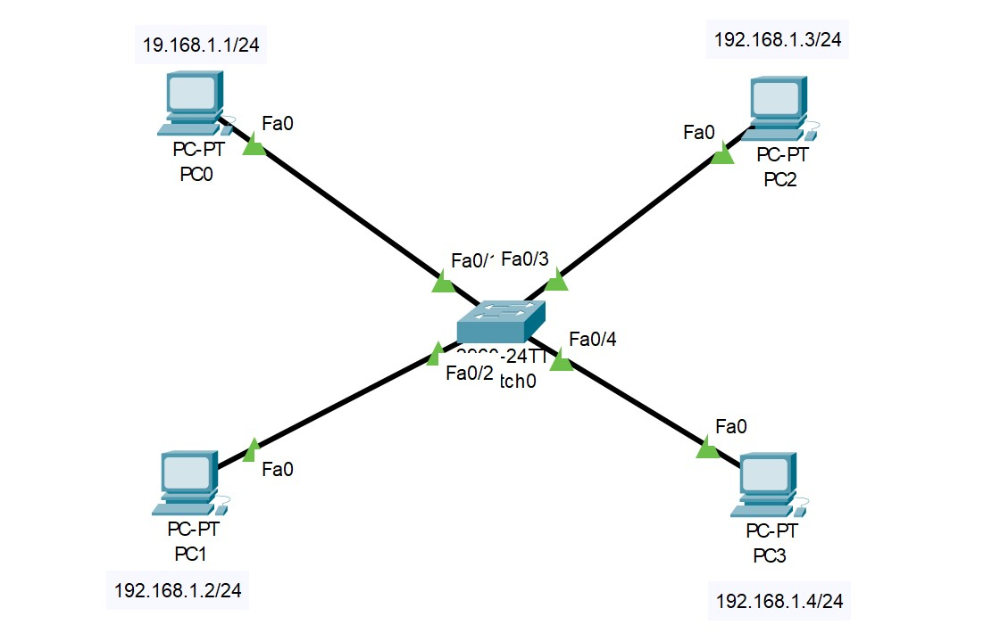
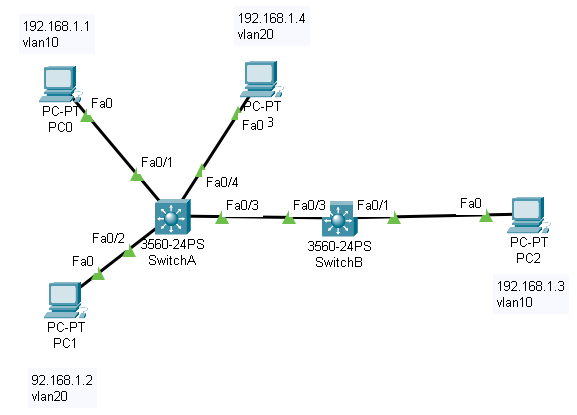

# switch 
想要構成一個網絡，我們先要把每一台電腦連結起來。如果有100台電腦，每一台電腦就要用網線連接99台電腦。根本上是不可能的(除非你很有錢)，所以我們需要SWITCH來把所有電腦連結起來，如果用switch，所有電腦只要用一個網絡接口連接switch就可以連結起所有電腦。


switch 基本是“即插即用”，在同一個網段(/subnet)可以互ping，如PC0可ping pc1; pc3可ping pc2。但pc0 不可ping pc2 ...

但這可能不是一個好方法，在大型企業中任意分subnet是十分浪費，同時這樣是很難管理。所以需要一種方法，在同一個subnet中分到不同的LAN。所以switch提供了一實用功能方便我們去管理網絡 — VLAN

# VLAN
在這裡想分享一個故事，叫所羅門王的審判。
> 話說有兩位娘親爭奪一個蘇蝦仔，都話蘇蝦是自己的。她們到了所羅門王求個公平，所羅門王於是決定將個蘇蝦劈開兩半，一人一半分平，其中一位母同意，另一個娘親卻為蘇蝦求情。她願意放棄蘇蝦並接受處罰。<br>
> 很明顯，寧願自己接受處罰以保全蘇蝦性命的女人，才是孩子真正的娘親。說謊的惡婦人於是受到嚴厲的懲處。

在網絡中我們也可以用VLAN把一個LAN劈開成多個。



首先我們要先起一個VLAN:
```cisco
switch(config)> valn 10
switch(config-if)> name CPS

switch(config)> valn 20
switch(config-if)> name ECE
```

之後把端口(界面)加入到vlan 10
```cisco
switch(config)> interface f0/1
switch(config-if)>switchsport access vlan 10

switch(config)> interface f0/2
switch(config-if)>switchsport access vlan 10

switch(config)> interface f0/3
switch(config-if)>switchsport access vlan 20

switch(config)> interface f0/4
switch(config-if)>switchsport access vlan 20
```
> 通常會簡寫成:
>```cisco
>switch(config)> int f0/3
>switch(config-if)> sw ac vlan 10
>
>switch(config)> int f0/4
>switch(config-if)> sw ac vlan 10
> ...
>```

設定後可用show vlan指令查看已設定的內容
```cisco
switch(config)> do show vlan
```
# Trunk
在同一個switch中同VLAN是可以互通的，但如果要經過多個switch就要用到trunk link。我們設定vlan是在舊的switchA中設定，所以目前所有valn只有舊的switchA知到，如果舊的switchA把vlan 10 的package交給另一個switchB，那麼讓新的switchB知道這個package是來自哪個vlan。

set Trunk 就是把switchA連接switchB的界面設定為trunk port，讓switchA知道如果要經這個prot出去，就要在package中加入vlan ID。用於標識來自哪個vlan。switchB連接switchA的界面設定為trunk port。


接下來了解一下如何在switch中設定把

0.開始前先要設定好vlan 和分配給指定的port

- switchA: f0/1->vlan10; f0/2->vlan20; f0/4->vlan20;
- switchB: f0/1->vlan10;
- 指令可參考上方

1.首先設定switch 另一個switch的溝通協議設為802.1q
- IEEE 802.1Q以及VLAN Tagging屬於網際網路下IEEE 802.1的標準規範，允許多個網橋在信息不被外洩的情況下公開的共用同一個實體網路。IEEE 802.1Q -英文縮寫寫為dot1q---维基百科

2.之後把port設為trunk prot
```cisco
switchA(config)> int f0/3
!設定Vlan制式
switchA(config-if)> switchport trunk encapsulation dot1q
!把port設為trunk prot
switchA(config-if)> switchport mode trunk

switchB(config)> int f0/3
!設定Vlan制式
switchB(config-if)> switchport trunk encapsulation dot1q
!把port設為trunk prot
switchB(config-if)> switchport mode trunk
```


> 通常會簡寫成:
>```cisco
>switchA(config)> int f0/3
>!設定Vlan制式
>switchA(config-if)> sw tr enc dot1q
>!把port設為trunk prot
>switchA(config-if)> sw mode trunk
> ...
>```

**這樣在同一個vlan的電腦就可以互ping了**

可用show interface trunk指令查看trunk port
```cisco
switch(config)> do show interface trunk
```

## allow VLAN
我們可以用switchport trunk allow vlan 20,30指令來允許/限制vlan在這個port 的通過
```cisco
switchA(config)> int f0/3
switch(config-if)>sw tr all vlan 20,30
```
這樣vlan 10就不可以通過f0/3到switchB，即就算在同一個vlan，亦開了trunk port， PC0 也不可以ping PC2。

之後我們也可以用 all/add/except/remove/none 來繼續操作vlan 的白名單
```cisco
switchA(config-if)> switchport trunk allow add vlan 40-48
switchA(config-if)> sw trunk all remove 20,45,46
switchA(config-if)> sw trunk all  all
switchA(config-if)> sw trunk all except 10-19
switchA(config-if)> sw trunk all none
```

可用show interface trunk指令查看可通過的trunk port
```cisco
switch(config)> do show interface trunk
```

# native vlan
navive vlan是為沒有vlan id 的package 通過的
> Native VLAN有一個作用是，所有沒有被貼上標籤的資料都會被送往這個Native VLAN。每個VLAN都會有一個ID，用來區分各個VLAN，而Native VLAN的預設ID就是VLAN 1。
> * https://www.netadmin.com.tw/netadmin/zh-tw/feature/0C1A2DDB3CF94296864832049D8897A4


### 一定要有native vlan?
> native VLAN存在的原因主要是支持VLAN與不支持VLAN的設備相互兼容，大部分計算機網卡、集線器等設備不能識別帶VLAN標籤的數據幀，只有去掉VLAN標籤，這些設備才能正確識別數據幀。
> * https://ppfocus.com/0/ho8691bc8.html

>參考
> * https://www.jannet.hk/virtual-lan-vlan-zh-hant/
> * https://mp.weixin.qq.com/s?__biz=Mzg2NjIyMzM5NA==&mid=2247545777&idx=2&sn=db84bf3f9495ccb6a7330157d1ecc16b&chksm=ce4c67fcf93beeea2b80ae9d729dfa45e4214784fabc3d7120a31bcb42a763b47f9a16df4791&cur_album_id=1981475157902753797&scene=190#rd

---
小弟仍在學習中，內容和理解上可能有遺漏和錯誤。歡迎指正~


