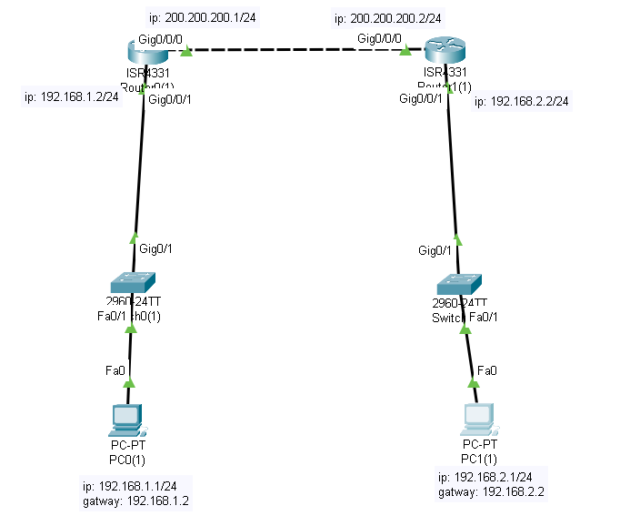

# router
router 是用來路由，它可以把不同網路連接把來。上一篇文章也提及，不同網段(/subnet)在只有switch情況下是不可互通的，但有了router就可以幫我們尋找目標IP和互相溝道。
- LAN要同域

# 靜態路由
我們要先把每一個router的每一個port位設上ip，並且啟用界面。
```cisco
int g0/0/1
! 設定IP
ip add 192.168.1.2 255.255.255.0
! 啟用界面
no sh
...
```
之後設定靜態路由
```cisco
ip route 192.168.2.0 255.255.255.0 200.200.200.2
```
- 192.168.2.0 255.255.255.0 位置指router 收到的IP段和subnet mask。
- 200.200.200.0 指下一跳IP/端口 (next hop)
> 當PC0 ping PC1 時，package 會交先給Router0，Router0見到192.168.2.1 在192.168.2.0/25 網段，就會交給200.200.200.2(Router1 g0/0/0界面)

### 例子


### R0(Router0)
```cisco
en
conf t
hostname R1

int g0/0/1
ip add 192.168.1.2 255.255.255.0
no sh

int g0/0/0
ip add 200.200.200.1 255.255.255.0
no sh

ip route 0.0.0.0 0.0.0.0 200.200.200.2
```

### R1(Router1)
```cisco
en
conf t
hostname R1

int g0/0/1
ip add 192.168.2.2 255.255.255.0
no sh

int g0/0/0
ip add 200.200.200.2 255.255.255.0
no sh

ip route 0.0.0.0 0.0.0.0 200.200.200.1
```


# 動態路由

```cisco
router eigrp 1
! 想動態的網段
notwork 192.168.12.0
notwork 192.168.23.0
aout-summary
```
---
小弟仍在學習中，內容和理解上可能有遺漏和錯誤。歡迎指正~

