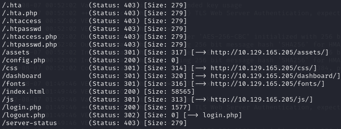
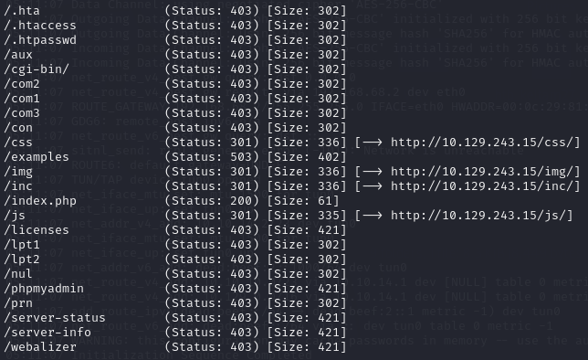

***歡迎來到HTB新手村***

Start here: https://app.hackthebox.com/starting-point

On environment Kali Linux and connect to HTB

Explain the linux command: https://explainshell.com/

Always ask google: https://www.google.com/

# 0.1 Meow

1. Check port 23 running service

   `nmap -p 23 -sV TARGET_IP`

2. telnet service is running, execute `telnet`

   `telnet TARGET_IP`

3. login with `root`

4. login succeed
5. `ls` to show what's there
6. `cat flag.txt`

# 0.2 Fawn

1. Check port 21 (FTP) running service

   `nmap -p 21 -sV TARGET_IP`

2. ftp service is running, execute `ftp`

   `ftp TARGET_IP`

3. login with name `anonymous` without password

4. `ls` and there is a *flag.txt*

5. copy the file to current directory

   ftp>`get flag.txt`

6. exit ftp by command `bye`, then `cat flag.txt`

# 0.3 Dancing

1. Check port 443 (SMB) running service

   `nmap -p 443 -sV TARGET_IP`

2. SMB service is running, see what is sharing in the server

   `smbclient -L TARGET_IP`

3. We are able to access with a blank password for the folder *WorkShares*

   `smbclient //TARGET_IP/WorkShares`

4. list the files in folder *WorkShares* smb: \> `ls`

5. Check the file *James.P* owns, the flag is inside *flag.txt*

6. smb: \James.P\> `get flag.txt`

# 0.4 Redeemer

1. Check the TCP port opened on the machine, `-T5` used for quicker enum, `-sS` is check for the TCP SYN scan (half of the TCP handshake), `-sV` is used to check the version of the service

   `nmap -p 1000-9999 -sSV -T5 TARGET_IP`

2. port 6379/tcp is opened for **Redis** service **version 5.0.7**, Redis is an **in-memory database**

3. connect to Redis server, `-h` means host

   `redis-cli -h TARGET_IP`

5. Connected success, select the first database in Redis: `select 0`

6. List all the keys in this database: `keys *`, the flag is in the *flag* key

7. Look at the value of the key *flag* by `get flag`

# 1.1 Appointment

1. Check port 80 (HTTPS), and it is running

   `nmap -p 80 TARGET_IP`

2. Browse TARGET_IP in browser

3. Input `admin'#` for username (which is **SQL injection**), do not empty the password field

# 1.2 Sequel

1. Check running service, and port 3306 is running *SQL* service

   `nmap -p 1000-9999 -sSV -T5 TARGET_IP`

2. We can connect to the database with user **root** by a blank password

   `mysql -h TARGET_IP -u root`

3. After connecting to the database, check what schema is there: `show database;`

4. Use the schema htb: `use htb;`

5. See what tables in the schema: `show tables;`

6. See what is inside the *config* table: `select * from config;`, flag is there

# 1.3 Crocodile

1. Check running service on port 21 with version detection

   `nmap -p 21 -sV TARGET_IP`

2. Check HTTP running service (port 80) with version detection

   `nmap -p 80 -sV TARGET_IP`

3. Use **gobuster** to check any useful **php** file

   `gobuster dir -u TARGET_IP -x php -w /user/share/wordlists/dirb/common.txt`

   

4. Check the TARGET_IP/login.php in browser

5. As FTP is running, go check the file in FTP

6. `ftp TARGET_IP`, login as `anonymous`, then `ls`

7. ftp> `get allowed.userlist`, ftp> `get allowed.userlist.passwd`

8. input the user **`admin`** with the corresponding password in **.passwd** file to login

# 1.4 Responder

1. Check all ports:`nmap -p- -T5 -sS TARGET_IP`
2. 
3. Check directories: `gobuster dir -u TARGET_IP -w /user/share/wordlists/dirb/common.txt`
4. 
