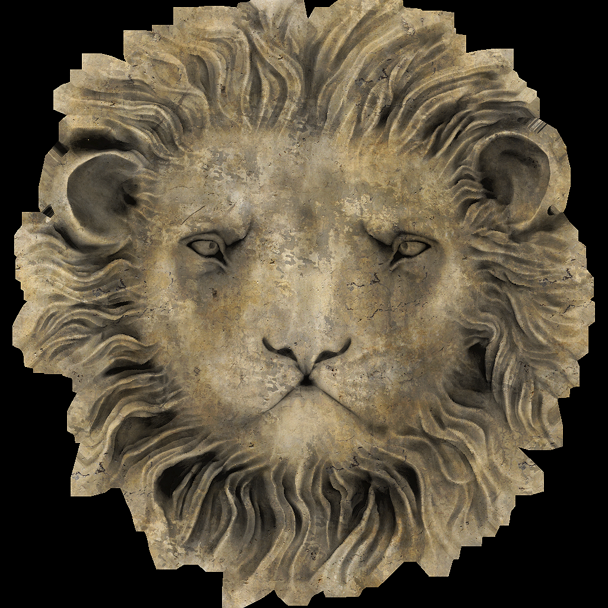

# SQ005 紋理(材質)的構成

紋理(材質)是甚麼?本質上就是一張圖片



一種可以讓著色器讀寫的結構化存取形式
```
Image [Height] [Width] [4]
T [512][512][4]
RGBA
```

# 紋理管線 (通常使用的架構)
1. 模型空間位置 -> 投影函數
2. 紋理映射 -> 紋理座標 (UV座標)
3. 通訊函數 -> 新紋理座標
4. 紋理採樣 (Sampler, 避免依賴紋理讀取) -> 紋理值

# UV值?
圖片文件都是二維方向上的平面。我們設水平方向是U，垂直方向是V，我們可以定位圖像上的任意一個像素。注意的是，(u,v)值範圍為[0,1]

UV就是將圖像上每一個點精確對應到模型物體的表面，在點與點之間的間隙位置進行圖像光滑插值處理，這就是所謂的UV貼圖。

對於NURBUS表面。因為具有UV參數，所以很容易通過換算把表面上的點和平面圖像上的像素對應起來。

# NURBUS?
非均勻有理B樣條
https://www.youtube.com/watch?v=LgZctC4uM3Q&t=325s&ab_channel=%E5%9B%9E%E5%BD%A2%E9%92%88PaperClip

三次方貝茲曲線的[[參數方程|參數]]形式為：

$$
\mathbf{B}(t)=\mathbf{P}_0(1-t)^3+3\mathbf{P}_1t(1-t)^2+3\mathbf{P}_2t^2(1-t)+\mathbf{P}_3t^3 \mbox{ , } t \in [0,1]
$$


# 例子
假設我們知道在模型空間位置需要渲染的點為 (-2.3,7.1,88.2)，經過投影函數的變換之後，我們會獲得一個uv值 (u,v)，換算回來就是 (0.32,0.29) 紋理座標 (UV座標)

已知紋理的大小為 256 * 256，我們把uv座標相乘256，獲得 (81.92,74.24)，紋理採樣設置則決定了此紋理值rgba值 (可自定義)


# 通訊函數
使圖像可以平移，縮放，旋轉

# 紋理採樣
- 著色器中紋理通常以SamplerVariable（採樣變量）的形式存在，它是一種uniform型變量，在處理不同片元時，它是已知不變的；
- 一個Sample與一個Texture對應，是一種特殊變量。如果是二維紋理時，則為Sampler2D；

# 紋理採樣設置: Wrap Mode
決定UV值在[0,1]以外的表現
- OpenGL --- "包裝模式" (Wrapping Model)
- DirectX --- "紋理尋址模式" (Texture Addressing Mode)
- Repeat Mirror Clamp Broder


# 紋理採樣設置: Filter Mode (過濾設置)
決定了當紋理由於變化而產生拉伸的時候，要採用哪一種濾波模式來調整它的表現


## 雙線性插值
目標圖像中新創造的像素值，是由源圖像位置在它附近的2*2區域4個鄰近象素的值通過加權平均計算。

假如我們想得到未知函數 ''f'' 在點 <math>P=\left( x, y\right)</math> 的值，假設我們已知函數 ''f'' 在 <math>Q_{11} = \left( x_1, y_1 \right) </math>, <math>Q_{12} = \left( x_1, y_2 \right) </math>, <math>Q_{21} = \left( x_2, y_1 \right) </math>, 及 <math>Q_{22} = \left( x_2, y_2 \right) </math> 四個點的值。

首先在 ''x'' 方向進行線性插值，得到
:<math>\begin{align}
f(x, y_1) &\approx \frac{x_2-x}{x_2-x_1} f(Q_{11}) + \frac{x-x_1}{x_2-x_1} f(Q_{21}), \\
f(x, y_2) &\approx \frac{x_2-x}{x_2-x_1} f(Q_{12}) + \frac{x-x_1}{x_2-x_1} f(Q_{22}).
\end{align}</math>

然後在 ''y'' 方向進行線性插值，得到 
:<math>\begin{align}
f(x,y) &\approx \frac{y_2-y}{y_2-y_1} f(x, y_1) + \frac{y-y_1}{y_2-y_1} f(x, y_2) \\
&= \frac{y_2-y}{y_2-y_1} \left ( \frac{x_2-x}{x_2-x_1} f(Q_{11}) + \frac{x-x_1}{x_2-x_1} f(Q_{21}) \right ) + \frac{y-y_1}{y_2-y_1} \left ( \frac{x_2-x}{x_2-x_1} f(Q_{12}) + \frac{x-x_1}{x_2-x_1} f(Q_{22}) \right ) \\
&= \frac{1}{(x_2-x_1)(y_2-y_1)} \big( f(Q_{11})(x_2-x)(y_2-y) + f(Q_{21})(x-x_1)(y_2-y)+  f(Q_{12})(x_2-x)(y-y_1) + f(Q_{22})(x-x_1)(y-y_1) \big)\\
&=\frac{1}{(x_2-x_1)(y_2-y_1)}  \begin{bmatrix} x_2-x & x-x_1 \end{bmatrix} \begin{bmatrix} f(Q_{11}) & f(Q_{12}) \\ f(Q_{21})& f(Q_{22}) \end{bmatrix} \begin{bmatrix}
y_2-y \\ y-y_1 \end{bmatrix}.
\end{align}</math>

注意此處如果先在 ''y'' 方向插值、再在 ''x'' 方向插值，其結果與按照上述順序雙線性插值的結果是一樣的。

### 例子
已知: 點P(u,v) = (81.92,74.24)
1. 點P(u,v) 減去 像素中心 (0.5,0.5) = (81.42,73.74)
2. 取得最接近的四個屏幕像素點範圍: (81,73) ~ (82,74)
3. 相對於該四個像素中心形成的座標系位置 (u,v) = (0.42,0.74)

:<math> f(x,y) \approx \begin{bmatrix}
1-x & x \end{bmatrix} \begin{bmatrix}
f(0,0) & f(0,1) \\
f(1,0) & f(1,1) \end{bmatrix} \begin{bmatrix}
1-y \\
y \end{bmatrix}</math>

插值顏色=(1-0.42)×(1-0.74)t(x,y)+0.42(1-0.74)×t(x+1,y)+(1-0.42)0.74t(x,y+1)+0.42×0.74×t(x+1,y+1)


# 備忘錄
Unreal Engine 5 自定義UV
https://docs.unrealengine.com/5.0/zh-CN/customized-uvs-in-unreal-engine-materials/


