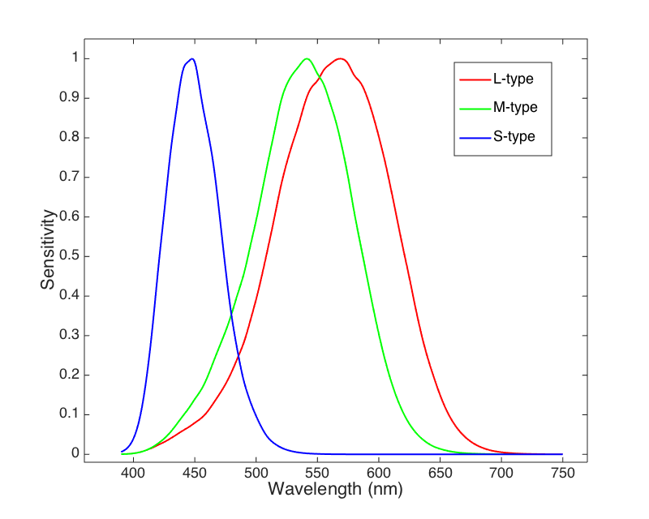
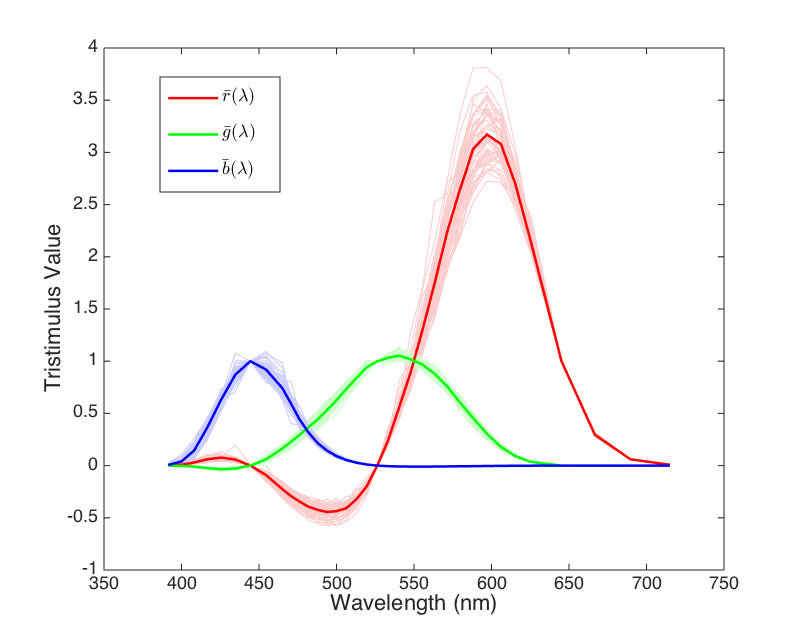
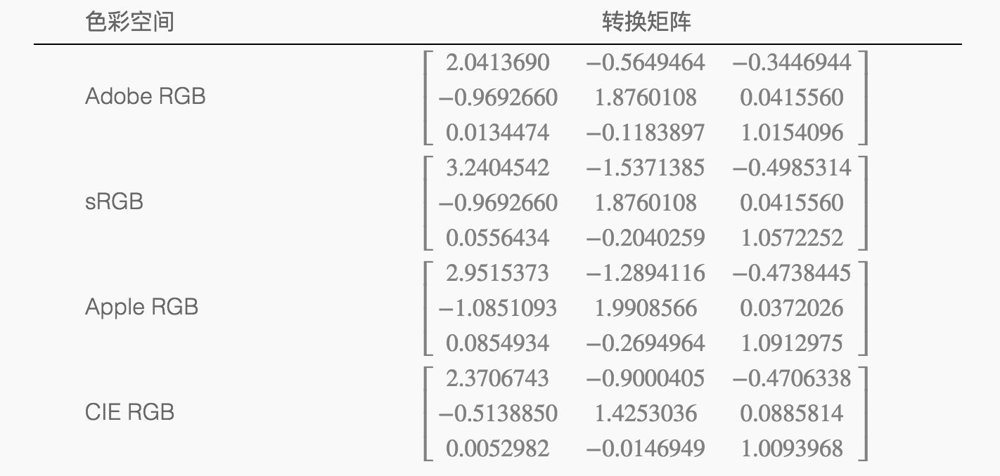
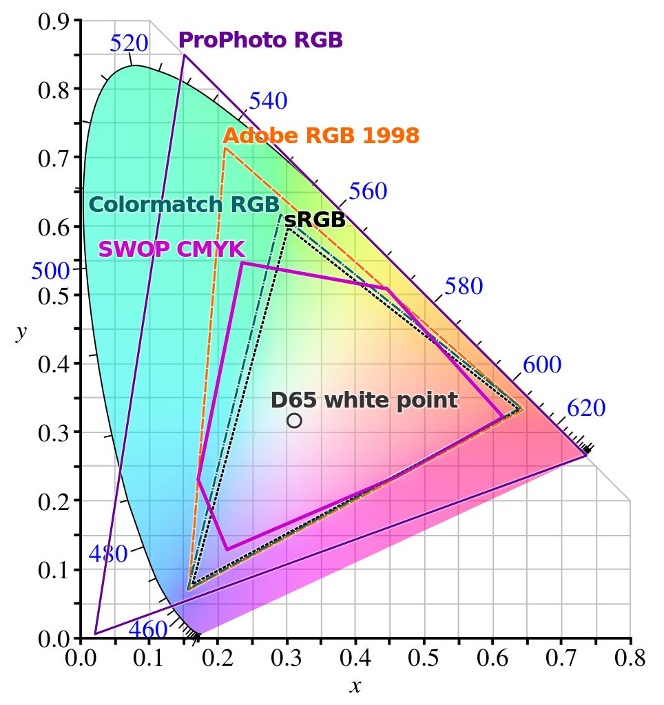

# Gamma校正 和 色彩空間

現在面臨需要解決的問題和場景:

* [快速了解Gamma校正](https://www.bilibili.com/video/BV15t411Y7cf/?spm_id_from=autoNext&vd_source=c8f797eb0ed2b9ae031c806a2b48a232)
* [Gamma, Linear, sRGB 這些都是甚麼?](https://blog.csdn.net/lrh3025/article/details/102723090?spm=1001.2101.3001.6661.1&utm_medium=distribute.pc_relevant_t0.none-task-blog-2%7Edefault%7ECTRLIST%7ERate-1-102723090-blog-117229466.pc_relevant_aa_2&depth_1-utm_source=distribute.pc_relevant_t0.none-task-blog-2%7Edefault%7ECTRLIST%7ERate-1-102723090-blog-117229466.pc_relevant_aa_2&utm_relevant_index=1)

# CIE RGB
人類眼睛有對於短（S, 420-440nm）、中（M, 530-540nm）和長（L, 560-580nm）波長的光感受器（視錐細胞）

> 三種視錐細胞最敏感的波長分別是橙紅色（長波，Long），綠色（中波，Medium），藍色（短波，Short）。下圖為三種視錐細胞的歸一化感光曲線

經過**實驗**以後，人們發現了可以使用三種顏色的光，來混合出現實中的任何一種顏色出來，有以下公式(色匹配函數 Color Matching Function): $C = rR + gG + bB$
> rgb分別為三種顏色光源強度

> 問題1: 他們是怎樣設計實驗過程 ? 人類眼睛對不同顏色光線混合的反應是線性的嗎 ?

# CIE RGB-> CIE XYZ
我們使用了色匹配函數來測試每個人的色匹配函數曲線

> 中間深色的粗線代表了數據的平均值

> 問題2: 在色匹配函數中RGB光源強度為0~1之間的數，為什麼匹配函數曲線上出現了負數? (提示: 根據公式: $C = rR + gG + bB$)

為了解決CIE RGB 色彩空間出現負數的問題，我們設計了一種轉換矩陣M，變換到所有數字都在正數的空間中，這就是CIE XYZ色彩空間

$$
\begin{bmatrix}
    R_{lin} \\
    G_{lin} \\
    B_{lin} 
\end{bmatrix} = 
M * 
\begin{bmatrix}
    X \\
    Y \\
    Z 
\end{bmatrix}
$$

> 問題3: 已知sRGB 的三原色和白色點XYZ座標
> 
> a) 求sRGB 到 XYZ 的轉換矩陣
> 
> b) XYZ 轉到 sRGB 的轉換矩陣

|三原色和白色點|XYZ座標|
|---|---|
|R|(0.64,0.33,0.03)|
|G|(0.30,0.60,0.10)|
|B|(0.15,0.06,0.79)|
|W|(0.95047,1.00000,1.08883)|

解答

根據公式: $C = rR + gG + bB$

可以先找到XYZ在新空間的基底向量，我們理想中RGB值為(1,1,1)時將等於白色

設$w$為$w_r, w_g, w_b$，則$w_rR, w_gG, w_bB 為新的基底向量，求w向量$

$$W = w_rR + w_gG + w_bB$$

$$W = [R,G,B]w$$

$$w = [R,G,B]^{-1}W$$

$$
w = [R,G,B]^{-1}W =
\begin{bmatrix}
    0.64&0.30&0.15 \\
    0.33&0.60&0.06 \\
    0.03&0.10&0.79
\end{bmatrix}^{-1}
\begin{bmatrix}
    0.95047 \\
    1.00000 \\
    1.08883
\end{bmatrix} = 
\begin{bmatrix}
    0.6445 \\
    1.1919 \\
    1.2029 \\
\end{bmatrix}
$$

$以w_rR, w_gG, w_bB 為新的基底向量，找出在C_{XYZ}它所對應的sRGB座標$

$$
1式: 
\begin{bmatrix}
    X \\
    Y \\
    Z 
\end{bmatrix} = 
M * 
\begin{bmatrix}
    R_{lin} \\
    G_{lin} \\
    B_{lin} 
\end{bmatrix}
$$

$$
2式: 
C_{XYZ} = r(w_rR) + g(w_gR) + b(w_bB)
$$

$$
2式矩陣:
C_{XYZ} = [R,G,B]
\begin{bmatrix}
    w_r&0&0 \\
    0&w_g&0 \\
    0&0&w_b 
\end{bmatrix}
\begin{bmatrix}
    r \\
    g \\
    b
\end{bmatrix}=
[w_rR,w_gR,w_bB]C_{RGB}
$$

$$
C_{XYZ} = 
\begin{bmatrix}
    0.64&0.30&0.15 \\
    0.33&0.60&0.06 \\
    0.03&0.10&0.79
\end{bmatrix}
\begin{bmatrix}
    0.6445&0&0 \\
    0&1.1919&0 \\
    0&0&1.2029 
\end{bmatrix}
\begin{bmatrix}
    r \\
    g \\
    b
\end{bmatrix}=
\begin{bmatrix}
0.4125 & 0.3576 & 0.1804 \\
0.2127 & 0.7151 & 0.0722 \\
0.0193 & 0.1192 & 0.9503
\end{bmatrix}C_{RGB}
$$

因此 sRGB 到 XYZ 的轉換矩陣M為($C_{XYZ} = M*C{sRGB}$):
$$
M = [w_rR,w_gR,w_bB] = 
\begin{bmatrix}
0.4125 & 0.3576 & 0.1804 \\
0.2127 & 0.7151 & 0.0722 \\
0.0193 & 0.1192 & 0.9503
\end{bmatrix}
$$

XYZ 到 sRGB 的轉換矩陣為M的逆矩陣($M^{-1}*C_{XYZ} = C{sRGB}$):
$$
M = [w_rR,w_gR,w_bB]^{-1} = 
\begin{bmatrix}
3.2403 & -1.5371 & -0.4985 \\
-0.9693 & 1.8760 & 0.0416 \\
0.0556 & -0.2040 & 1.0572
\end{bmatrix}
$$

# 題外話
在此基礎下sRGB值還是有可能會回到負值，那麼超出值將會強制歸0(回到sRGB的三角形內)，所以sRGB下的圖像會損失部分準確性

從CIE XYZ空間轉換後得到了一個線性的RGB值，要令顯示器正常顯示，就要對其使用gamma校正，每個空間的gamma校正公式都不太一樣(通常為$C = C_{lin}^{1/\gamma},\gamma =2.2$)，用sRGB空間作為例子，就使用了分段函數:

$$
C = \begin{cases}
12.92C_{lin},\quad &x\leq 0.0031308 \\
1.055C_{lin}^{1/2.4}-0.055,\quad &x>0.0031308
\end{cases} 
$$

# CIE XYZ 色彩空間

CIE XYZ 色彩空間，滿足一些約束條件：

+ 所有坐標都是正的，保持等能點（equal energy point）作為白色
+ 使得新的 Y 坐標能夠代表明度，也就是使得新的 Y 坐標等於視覺的明度響應
+ 使得新的 Z 坐標在紅光端保持為 0
+ 使得所有色彩盡可能充滿新的空間

> 實際上所有可視顏色的完整繪圖是三維的(你可以發現這裡只有x和y)，CIE 1931色彩空間色度圖。外側曲線邊界是光譜（或單色）光軌跡，波長用奈米標記。注意描繪的顏色依賴於顯示這個圖象的設備的色彩空間，沒有設備能有足夠大色域來在所有位置上提供精確的色度表現

# 甚麼是Gamma校正
灰階分成兩種: 

- 非線性灰階（視覺上看著均勻變化的）

- 物理/線性灰階（物理上均勻變化的）。

Gamma校正就是把兩者聯繫起來的函數，用來做兩者的轉換。

# 為什麼要Gamma校正
1. 人眼對於灰色的變化更敏感
2. 早期顯示器(CRT)發展需要節能

# 嘗試在unity 色彩空間使用Gamma校正

# 參考資料
* [色彩空间基础](https://zhuanlan.zhihu.com/p/24214731)

